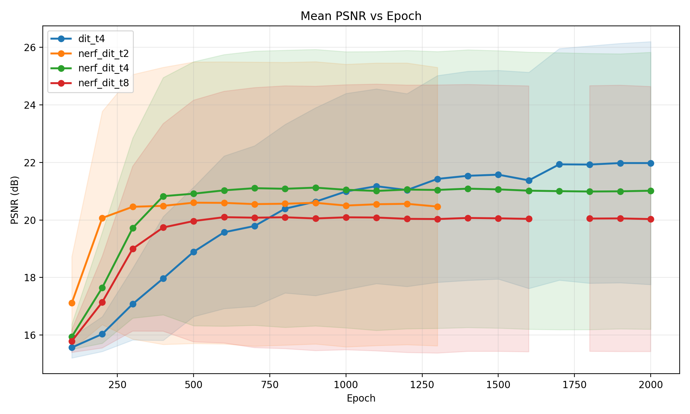
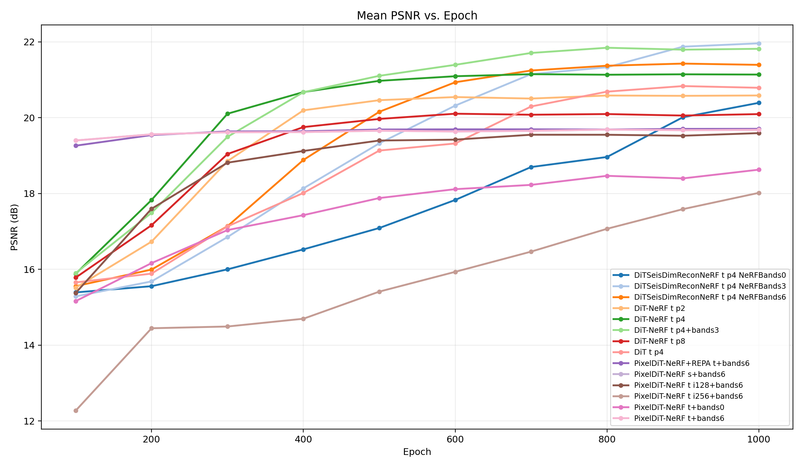
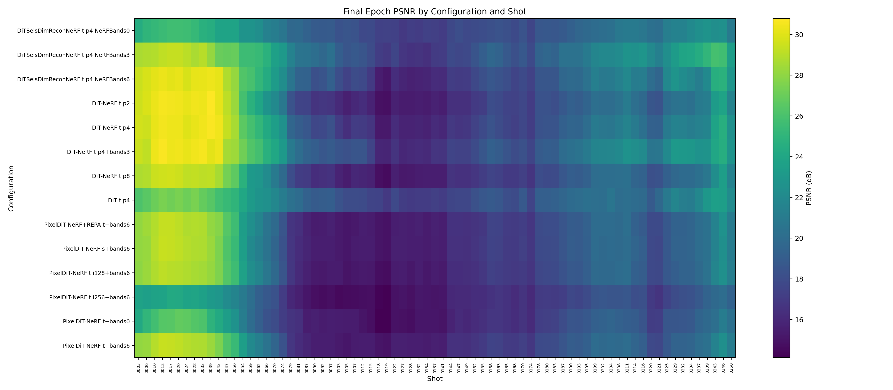
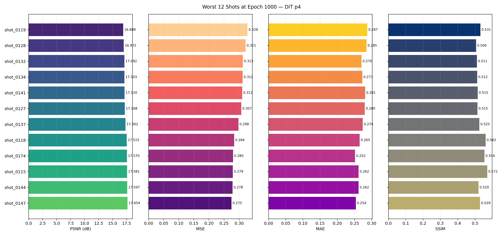
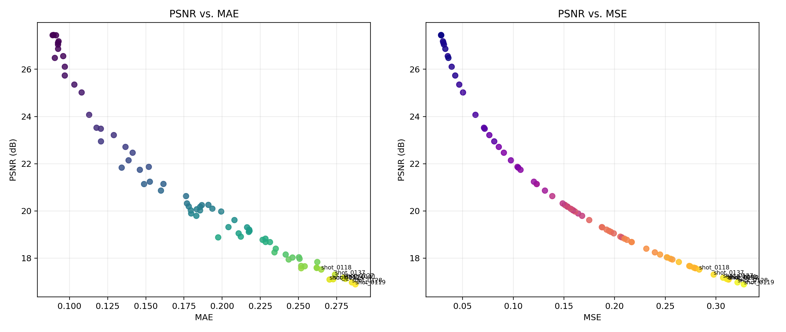

# 研究日志：2028-08-27

## 1. 当前测试方法和效果

主要指标是 75 个验证炮的平均 PSNR。不同批次的代码和训练设置可能略有变化，因此旧结果和新结果主要用于观察趋势，不应只按小数点后的差值判断优劣。

### 早期长训练结果

| 方法 | 最好结果 | 简单结论 |
| --- | ---: | --- |
| DiT t4 | 21.978 dB，epoch 1900 | 收敛慢，1000 epoch 后仍能提高，但波动较明显。 |
| NeRF-DiT t2 | 20.601 dB，epoch 500 | 前期最快，但很早进入平台，最终较低。 |
| NeRF-DiT t4 | 21.124 dB，epoch 900 | 比普通 DiT 收敛快，最终低于长时间训练的普通 DiT。 |
| NeRF-DiT t8 | 20.098 dB，epoch 600 | 收敛和最终效果都不理想。 |

早期结果说明：NeRF 主要改善前期学习速度；普通 DiT 学得慢，但训练足够久后可能更好。t4 比 t2 和 t8 更合适。

### 当前 DiT 和 NeRF-DiT 结果

| 方法 | 最好平均 PSNR | 结论 |
| --- | ---: | --- |
| DiT t-p4 | 20.834 dB，epoch 900 | 1000 epoch 内仍在缓慢提高，后期有小幅波动。 |
| NeRF-DiT t-p2 | 20.586 dB，epoch 1000 | 收敛较快，但上限较低。 |
| NeRF-DiT t-p4 | 21.147 dB，epoch 700 | 基础 NeRF 中最好，700 epoch 后基本进入平台。 |
| NeRF-DiT t-p4 + bands3 | 21.844 dB，epoch 800 | Fourier 编码有效，明显优于基础 NeRF。 |
| NeRF-DiT t-p8 | 20.104 dB，epoch 600 | 比 p4 差，说明较大的内部 patch/token 设置不合适。 |

### 当前重构版本、EMA 和频带结果

| NeRF 频带 | 无 EMA | EMA | 结论 |
| --- | ---: | ---: | --- |
| bands0 | 20.391 dB | 21.203 dB | 收敛稳定，但坐标表达能力有限。 |
| bands3 | 21.961 dB | **22.650 dB** | 当前最好结果；速度、上限和稳定性最平衡。 |
| bands6 | 21.427 dB | 21.698 dB | 前期快，但约 800～900 epoch 后停止提高，炮间差异最大。 |

EMA 对三个频带都有帮助，提升约 0.27～0.81 dB。bands3 明显优于 bands0 和 bands6，说明频率过少表达不足，频率过多可能增加优化难度和高频敏感性。

当前所有结果中，NeRF bands3 + EMA 的平均 PSNR 最高。原来“NeRF 最终一定不如普通 DiT”的结论需要修正：基础 NeRF 容易较早进入平台，但合适的 Fourier 频带和 EMA 可以超过普通 DiT。

### PixelDiT 结果

| 方法 | 最好平均 PSNR | 结论 |
| --- | ---: | --- |
| PixelDiT t-i64 bands0 | 18.628 dB | 没有 Fourier 频带时效果较差。 |
| PixelDiT t/s-i64 bands6 | 19.685 dB | 约 100～300 epoch 已接近平台，收敛很快但最终不高。 |
| PixelDiT t-i128 bands6 | 19.593 dB | 与 i64 接近，没有明显收益。 |
| PixelDiT t-i256 bands6 | 18.017 dB | 明显变差，当前训练设置不适合大输入。 |
| PixelDiT + REPA t-i64 bands6 | 19.706 dB | 只有很小提升，暂时看不到明显优势。 |

PixelDiT 的主要特点是收敛快，但较早进入较低的平台。当前仍以 DiT + NeRF bands3 + EMA 更有希望。

### 当前总体判断

1. NeRF 能明显加快前期收敛，但基础版本容易较早进入平台。
2. 普通 DiT 收敛慢，训练后期还能提高，但波动较大。
3. NeRF bands3 + EMA 是当前最佳组合。
4. bands6 不如 bands3，可能存在过度高频编码。
5. EMA 能减少参数瞬时波动，并提高最终平均 PSNR。
6. PixelDiT 收敛最快，但当前最终效果低于 DiT 系列。
7. 随着训练继续，简单炮提高很多，困难炮仍停留在较低水平，因此炮间 PSNR 标准差不断增大。

注意：当前 `psnr_analysis` 汇总脚本只匹配了无 EMA 目录，没有把 `ema_epoch` 结果写入 CSV。上面的 EMA 数值是直接从 EMA 测试目录重新统计得到的。

### 测试结果图片

图 1 是早期长训练结果。可以看到 NeRF 前期上升快，普通 DiT 上升慢，但在 1000 epoch 后仍继续提高。

图 2 是当前各方法的平均 PSNR 曲线。该图使用现有汇总结果，其中带 EMA/no-EMA 双目录的实验只包含无 EMA 数据。

图 3 显示每种方法在最终 epoch 对不同炮的 PSNR。颜色差异说明简单炮和困难炮之间的差距较大。

## 2. 最差测试记录、数据特征和可能原因

最差样本分析使用普通 DiT t-p4、epoch 1000 的结果。

- 最差炮是 `shot_0119`：PSNR 16.888 dB，MSE 0.328，MAE 0.287，SSIM 0.531。
- 最差 12 炮主要是：`0115、0118、0119、0127、0128、0132、0134、0137、0141、0144、0147、0174`。
- 大部分最差炮集中在连续的 115～147 区间，说明误差可能与特定炮位置、采集几何或这一段数据分布有关，不像完全随机误差。
- 最差 12 炮的 PSNR 约为 16.89～17.65 dB，SSIM 约为 0.51～0.57。
- 多数最大绝对误差接近 4。数据范围约为 `[-2, 2]`，这通常表示局部出现了正负号相反或相位错位的强振幅。

从差值图看，误差主要沿着地震同相轴和强反射结构分布，不是均匀随机噪声。复杂、弯曲、密集和交叉的反射事件更难重建；深部弱信号区域也有较多残余误差。

可能原因按优先级排列如下：

1. **patch 上下文不足。** 64×64 patch 很难完整描述跨越较大范围的倾斜或弯曲同相轴。
2. **重叠 patch 的初始噪声不一致。** 每个 patch 独立生成随机噪声，会让同一重叠位置从不同初始状态开始生成。
3. **patch 边界上下文不同。** 即使共享初始噪声，各 patch 仍独立执行模型和 ODE，边缘位置看到的邻域不同，最终结果仍可能不完全一致。
4. **高频相位和振幅误差。** 对地震数据来说，小的相位偏移也会产生较大的逐像素误差。
5. **困难炮分布不足。** 最差炮集中在连续区间，可能说明训练数据没有充分覆盖该采集几何或该类复杂结构。
6. **后期参数波动。** 无 EMA 的普通 DiT 在 1000 epoch 后波动明显，可能使部分炮变好、部分炮变差。
7. **全局裁剪和归一化影响。** 强振幅被裁剪后，局部符号或相位错误容易达到最大误差 4；全局尺度也可能压缩弱信号差异。

当前差值图中的误差以结构误差为主，没有看到误差完全由规则方格接缝控制。因此，独立 patch 噪声是重要嫌疑，但可能不是唯一原因。

### 最差炮测试图片

图 4 给出最差 12 炮的原始数据、重建结果和差值。误差主要沿同相轴、强反射和复杂弯曲结构分布。

图 5 对比最差 12 炮的 PSNR、MSE、MAE 和 SSIM。

图 6 显示全部验证炮中 PSNR 与 MAE、MSE 的关系。低 PSNR 炮同时具有较高的 MAE 和 MSE。

## 3. 当前计划开展的测试

### 固定共享噪声测试

已经完成程序和脚本准备，但还没有结果。

1. 先生成一份完整的标准高斯随机炮，再从随机炮中切出 noise patch。
2. 相邻 noise patch 的重叠区域来自同一份全局噪声，因此初始值一致。
3. 普通 DiT 使用 `DiTSeisDimReconExternalNoise.py` 测试。
4. NeRF-DiT 使用 `DiTSeisDimReconNeRFExternalNoise.py` 测试。
5. NeRF 分别测试 bands0、bands3 和 bands6。
6. 对相同 checkpoint 同时比较 EMA 和无 EMA。
7. 所有 epoch 使用同一套固定 noise，避免随机种子变化干扰模型比较。

这个测试只能验证“共享初始噪声”的作用。它不能保证最终重叠输出完全一致，因为每个 patch 后面的 ODE 过程仍然独立。

### 后续候选测试

1. 比较独立噪声与共享噪声的平均 PSNR、SSIM、MAE 和 MSE。
2. 单独统计 patch 重叠带和 patch 内部区域的误差。
3. 重点比较 `shot_0119、0128、0132、0134、0141` 等困难炮。
4. 使用多个固定随机种子重复测试，判断结论是否稳定。
5. 如果共享噪声改善有限，再测试更大的图像 patch、更大的重叠范围，以及只保留 patch 中心区域。
6. 研究训练前期使用 NeRF、后期减弱或移除 NeRF 编码的分阶段方案。

## 4. 下一步工作计划

1. 运行 `build_shot_dataset.sh`，生成与真实数据完全对应的随机炮和 noise patch。
2. 在正式推理前检查真实数据与 noise 数据的文件名、patch 数量、顺序和重叠区域是否一致。
3. 优先运行普通 DiT 和 NeRF bands3 + EMA 的共享噪声测试，再运行 bands0、bands6 和无 EMA 对照。
4. 修正 PSNR 汇总脚本，让 EMA、无 EMA 和 ExternalNoise 结果分别记录，避免结果相互覆盖或遗漏。
5. 增加重叠区域专项指标：边界误差、内部误差和两者比例。
6. 对最差炮制作固定版式对比图：原始数据、独立噪声结果、共享噪声结果和差值图。
7. 根据共享噪声结果决定后续方向：
   - 如果接缝和 PSNR 明显改善，将全局共享噪声作为默认推理方式。
   - 如果改善很小，优先解决 patch 上下文不足和独立 ODE 过程不一致的问题。
8. 完成推理问题验证后，再考虑 NeRF 到普通 DiT 的分阶段训练，避免同时改变太多因素。
