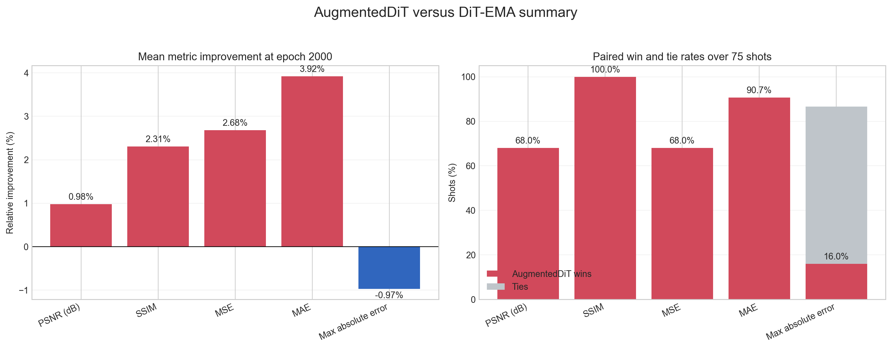
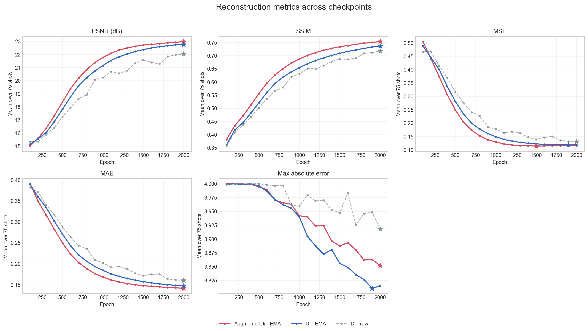
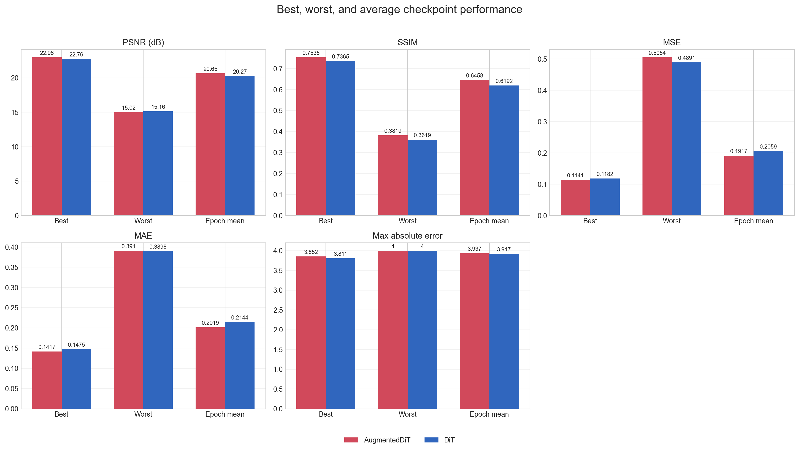
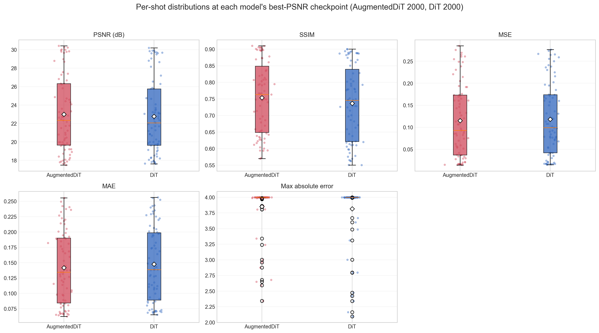
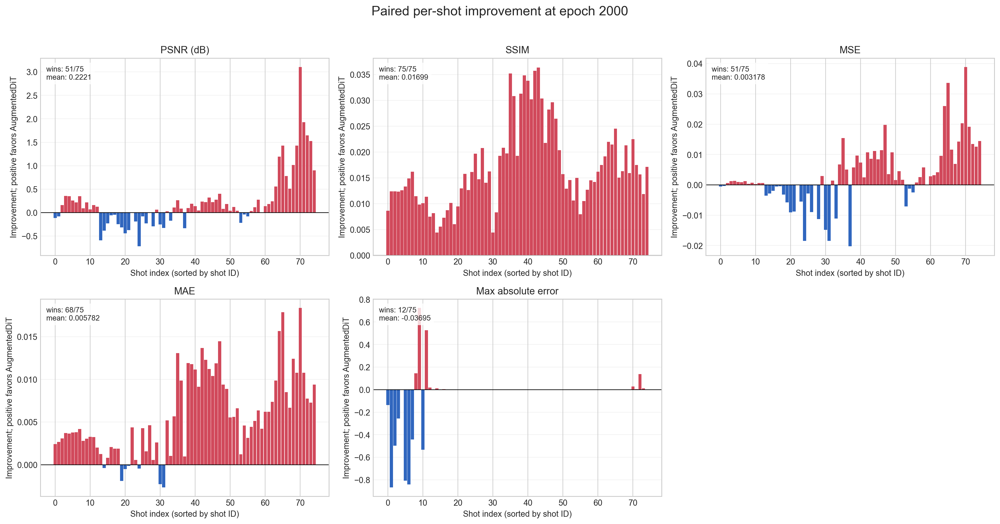

# 研究方向：AugmentedDiT 架构对照

- 级别：保留
- 最后更新：2026-09-01

## 研究目的

- 验证 PixelDiT 中的 `AugmentedDiTBlock` 脱离 pixel-level `PiTBlock` 分支后，能否作为独立的二维 flow-matching 主干完成地震 patch 重建。
- 在输入尺寸、内部 patch size、宽度、深度、attention head、数据、优化器和采样流程尽量一致的条件下，对比 AugmentedDiT 与传统 Diffusers DiT 的收敛、最终精度和计算成本。
- 区分 PixelDiT 的收益或退化来自 augmented patch backbone，还是来自后续 pixel-level 分支。

## 当前结论

- 当前判断：在 T/P4、i64、NeRF bands0、EMA 的75炮对照中，AugmentedDiT 相比传统 DiT 有轻微改进，但尚不足以说明存在显著架构优势。
- 主要证据：epoch 2000 的平均 PSNR 为22.984 dB，对照为22.762 dB（+0.222 dB）；平均 SSIM为0.7535，对照为0.7365；MSE和MAE分别降低2.68%和3.92%。AugmentedDiT 在75炮中的 PSNR、MSE均胜出51炮，SSIM胜出75炮，并在20个checkpoint中的19个取得更高平均PSNR。
- 局限或尚未确认的问题：最大绝对误差略差0.97%，复杂断层和强干涉区域仍是两种模型的主要困难；当前只有一个随机种子，且两者参数量、时间编码、归一化、RoPE、QK Norm和FFN设计并非完全一致，不能把轻微增益归因于单一模块。

## 实验记录

### 2026-08-31：独立模型、训练入口与对照方案准备

- 相关月志：[2026-08-31](202608.md#2026-08-31)
- 目的：从 PixelDiT 中抽出 augmented patch backbone，构建可独立训练、保存和采样的二维模型，并准备与 DiT-T/P4 的 i64/bands0 对照。
- 方法与配置：`AugmentedDiT2DModel` 使用 patchify → `PatchTokenEmbedder` → 8层 `AugmentedDiTBlock` → 条件 patch 输出层 → fold；T 配置为 hidden size 384、6 heads、depth 8、patch size 4，时间编码 `max_period=10`。训练入口使用 `shot_dataset64`、NeRF bands0、batch size 32/process、2000 epochs、每100 epochs保存、upcast attention、默认 EMA（decay 0.999）、seed 0。
- 对照：`DiTSeisDimReconNeRF.py` 的 `DiT_T_4`，输入64、hidden size 384、6 heads、8层、patch size 4；数据、batch、epoch、优化器默认值、EMA、upcast attention和保存间隔相同。两个脚本均配置5个 worker节点加master，节点编号不同。
- 结果：实现与定向测试完成，尚未产生训练 checkpoint、验证指标或整炮重建结果。
- 观察：在当前3输入通道配置下，AugmentedDiT约21.83M参数，DiT约23.58M参数；模型尺度接近但不完全等参数。当前 Trainer 的 flow-matching 时间为连续 `t∈[0,1]`，`max_period=10` 能让更多时间编码维度在该区间产生明显变化。
- 解释：现阶段只能说明实现链路和比较入口可用。若未来 AugmentedDiT 指标变化，应先视为整套 augmented block 设计的总体差异，不能在没有进一步消融时归因于 RoPE、RMSNorm、QK Norm 或 FFN 中的单个因素。

#### 版本与实现

- Git：`2ff25af`（dirty）；核心模型、wrapper、独立入口和 hwgpu 脚本由 `b068c99` 引入，当前训练参数更新到 `2ff25af`。
- 未提交相关文件：`tests/test_augmented_dit.py`、`tests/test_augmented_dit_trainer.py`、`research_logs/202608.md`、`research_logs/directions_augmented_dit.md`、`research_logs/directions_board.md`。
- 入口脚本：`scripts/hwgpu/train_AugmentedDiTSeisDimReconNeRF_t_i64_NerfBands0.sh`、`scripts/hwgpu/recon_AugmentedDiTSeisDimReconNeRF_t_i64_NerfBands0.sh`；对照为 `scripts/hwgpu/train_DiTSeisDimReconNeRF_t_p4_i64_NeRFBands0.sh` 和对应 recon 脚本。
- 主要代码：`models/pixeldit.py`、`models/wrapper.py`、`AugmentedDiTSeisDimReconNeRF.py`、`core/trainer.py`、`core/sampler.py`。
- 测试代码：`tests/test_augmented_dit.py`、`tests/test_augmented_dit_trainer.py`；同时回归 `tests/test_pixeldit.py`、`tests/test_pixeldit_trainer.py` 和 `tests/test_dit_trainer.py`。
- 关键配置：AugmentedDiT-T/P4、i64、NeRF bands0、`max_period=10`、upcast attention、batch size 32/process、2000 epochs、EMA decay 0.999、seed 0、solver step size 0.05、clip `[-1,1]`。
- Checkpoint：尚未生成。
- 结果目录：训练根目录计划为 `$PROJ_DIR/train_AugmentedDiTSeisDimReconNeRF_t_i64_NerfBands0/`，重建根目录计划为 `$PROJ_DIR/recon_AugmentedDiTSeisDimReconNeRF_t_i64_NerfBands0/`；具体运行子目录待训练后记录。

### 2026-09-01：AugmentedDiT 与传统 DiT 重建结果对比

- 目的：比较两种 T/P4、i64、NeRF bands0 模型在相同75炮验证集上的重建效果。
- 方法与配置：比较 AugmentedDiT EMA（下文A）与 DiT EMA（下文B）的 epoch 100–2000 重建结果；两者均使用 patch size 4，最终逐炮统计取 epoch 2000。DiT 非EMA结果仅用于说明EMA收益，不作为架构主对照。
- 对照：`recon_DiTSeisDimReconNeRF_t_p4_i64_NeRFBands0` 中的 EMA 结果。AugmentedDiT 结果目录未在名称中写 `ema`，但重建使用默认开启的 `use_ema=True`，因此A是EMA结果。
- 结果：AugmentedDiT 的平均 PSNR/SSIM为22.984 dB/0.7535，DiT为22.762 dB/0.7365；AugmentedDiT 的 MSE和MAE分别降低2.68%和3.92%，但最大绝对误差增加0.97%。
- 观察：AugmentedDiT 在收敛中前期优势更明显，最终优势缩小；简单连续层状结构两者都较好，复杂断层和强干涉区域仍较差。
- 解释：当前结果支持“AugmentedDiT 有轻微改进”，不支持大幅提升或已解决局部复杂区恢复问题。

#### Epoch 2000逐炮统计

“最差/最好”均按指标方向定义：PSNR、SSIM越高越好，MSE、MAE、最大绝对误差越低越好。表中的最小值和最大值是75炮中的数值范围。

| 指标 | A平均 | A最小–最大 | B平均 | B最小–最大 | A相对B变化 | A胜/平/负 |
|---|---:|---:|---:|---:|---:|---:|
| PSNR（dB） | 22.9842 | 17.4932–30.4151 | 22.7621 | 17.6250–30.1979 | +0.2221 dB | 51/0/24 |
| SSIM | 0.75350 | 0.57049–0.91032 | 0.73651 | 0.55075–0.90048 | +0.01699 | 75/0/0 |
| MSE | 0.11536 | 0.01454–0.28497 | 0.11854 | 0.01529–0.27645 | 降低2.68% | 51/0/24 |
| MAE | 0.14173 | 0.06241–0.25539 | 0.14751 | 0.06544–0.25641 | 降低3.92% | 68/0/7 |
| 最大绝对误差 | 3.85205 | 2.34356–4.00000 | 3.81510 | 2.09362–4.00000 | 增加0.97% | 12/53/10 |

- A在PSNR和MSE上胜出51/75炮，在MAE上胜出68/75炮，SSIM在75炮上全部胜出。
- 最大绝对误差不支持A更好：两组大量结果达到裁剪上限4.0，53炮持平，A仅胜出12炮，因此该指标区分度有限。

#### Checkpoint收敛与稳定性

| 指标 | A最好（epoch） | A最差（epoch） | A平均 | B最好（epoch） | B最差（epoch） | B平均 | A胜出 |
|---|---:|---:|---:|---:|---:|---:|---:|
| PSNR（dB） | 22.9842（2000） | 15.0166（100） | 20.6505 | 22.7621（2000） | 15.1557（100） | 20.2653 | 19/20 |
| SSIM | 0.75350（2000） | 0.38192（100） | 0.64582 | 0.73651（2000） | 0.36193（100） | 0.61919 | 20/20 |
| MSE | 0.11412（1500） | 0.50539（100） | 0.19168 | 0.11822（1900） | 0.48914（100） | 0.20591 | 19/20 |
| MAE | 0.14173（2000） | 0.39105（100） | 0.20186 | 0.14751（2000） | 0.38984（100） | 0.21437 | 19/20 |
| 最大绝对误差 | 3.85205（2000） | 3.99999（100） | 3.93731 | 3.81102（1900） | 3.99994（400） | 3.91747 | 3/20 |

- A的平均PSNR在20个checkpoint中的19个高于B，SSIM在20个checkpoint中全部更高，说明轻微优势并非只来自单个checkpoint。
- A的平均PSNR领先在epoch 900附近最大，约为0.647 dB；到epoch 2000缩小至0.222 dB，主要体现为收敛更快和最终小幅领先。
- 按MSE选择时，A的最佳checkpoint是epoch 1500（0.11412），B是epoch 1900（0.11822）；最终PSNR和SSIM则均在epoch 2000最好。

#### 最好、最差和差异最大的炮

| 情况 | 炮号 | A PSNR（dB） | B PSNR（dB） | A−B（dB） |
|---|---|---:|---:|---:|
| 两者最好 | `shot_0039` | 30.4151 | 30.1979 | +0.2171 |
| A最差 | `shot_0127` | 17.4932 | 17.6651 | -0.1720 |
| B最差 | `shot_0128` | 17.7323 | 17.6250 | +0.1073 |
| A提升最大 | `shot_0237` | 26.3316 | 23.2281 | +3.1035 |
| A退化最大 | `shot_0097` | 21.2269 | 21.9470 | -0.7201 |

- 两种模型的最好结果均为 `shot_0039`，A略高0.217 dB。
- A不是对每炮都更好：`shot_0097`退化0.720 dB，说明平均收益不能替代困难炮检查。
- 从重建与误差图观察，简单、连续层状同相轴两者均能较好恢复；密集断层、弯曲或交叉同相轴和强干涉区域仍容易出现结构、振幅与相位误差，误差具有连续事件形态，而非单纯随机噪声。

#### EMA影响

| 指标 | DiT EMA | DiT非EMA | EMA变化 |
|---|---:|---:|---:|
| PSNR（dB） | 22.7621 | 22.0469 | +0.7152 dB |
| SSIM | 0.73651 | 0.71826 | +0.01825 |
| MSE | 0.11854 | 0.13100 | 降低9.51% |
| MAE | 0.14751 | 0.16036 | 降低8.01% |
| 最大绝对误差 | 3.81510 | 3.91828 | 降低2.63% |

- DiT的EMA结果明显优于非EMA结果，因此架构结论必须使用A-EMA与B-EMA比较；若误把B的非EMA结果作为对照，会夸大AugmentedDiT的收益。

#### 综合结论

1. AugmentedDiT 相比传统 DiT 有轻微且较稳定的整体改进：最终平均PSNR提高0.222 dB，SSIM全面占优，MSE和MAE小幅下降。
2. 改进主要体现为平均质量和收敛速度，不是数量级提升；最终阶段的领先幅度小于中期。
3. 最大绝对误差略差，部分炮仍退化，复杂局部结构的恢复难题没有解决。
4. 当前仅有单随机种子且结构差异不止一个，因此尚不能断言收益来自 `AugmentedDiTBlock` 中的某个具体设计。

#### 版本与实现

- Git：`aa8b29d`（dirty）。
- 未提交相关文件：`scripts/analysis/plot_augmented_dit_vs_dit.py`、`research_logs/images/20260901/*.png`、`research_logs/directions_augmented_dit.md`、`research_logs/directions_board.md`。
- 入口脚本：`scripts/hwgpu/recon_AugmentedDiTSeisDimReconNeRF_t_i64_NerfBands0.sh`；对照为对应的 DiT recon 脚本。
- 主要代码：`AugmentedDiTSeisDimReconNeRF.py`、`DiTSeisDimReconNeRF.py`、`scripts/analysis/plot_augmented_dit_vs_dit.py`。
- 关键配置：T/P4、i64、NeRF bands0、EMA、75炮、epoch 100–2000。
- 结果目录：`temp/new/recon_AugmentedDiTSeisDimReconNeRF_t_i64_NerfBands0/`、`temp/new/recon_DiTSeisDimReconNeRF_t_p4_i64_NeRFBands0/`、`temp/new/AugmentedDiT_vs_DiT_i64_NeRFBands0_statistics/`。

## 测试设计

### 阶段1：实现和 smoke test

- 验证方形与矩形输入的 patchify/fold 输出 shape，确保输入高宽可被 patch size 整除。
- 验证 concat conditioning 后的通道数、默认类别标签、REPA 指定层特征和投影 shape。
- 验证 `max_period` 改变时间 embedding，且通过 Diffusers config 保存和恢复。
- 验证不兼容的 RoPE head dimension 能在构造期明确报错。
- 验证训练 parser 将 `model_arch`、patch size、`max_period` 和 upcast attention 传入 builder，并正确分发 train/sample。

### 阶段2：端到端 T/P4 对照

| 项目 | AugmentedDiT | Diffusers DiT |
|---|---:|---:|
| 输入 | 64×64 | 64×64 |
| 内部 patch size | 4 | 4 |
| hidden size | 384 | 384 |
| depth | 8 | 8 |
| heads | 6 | 6 |
| token 数 | 256 | 256 |
| NeRF bands | 0 | 0 |
| batch/process | 32 | 32 |
| epochs | 2000 | 2000 |
| upcast attention | 开启 | 开启 |
| EMA | 默认开启 | 默认开启 |

- 使用相同训练/验证炮、相同 patch 数据、相同随机种子、优化器、学习率、梯度裁剪和采样步长。
- 每100 epoch比较验证集 MSE、PSNR和整炮重建，记录 EMA checkpoint 的收敛趋势。
- 同时记录参数量、峰值显存、samples/s、optimizer step 数、wall-clock和 GPU-hours；由于两个脚本使用不同物理节点，速度比较前需确认GPU型号和负载一致。

### 阶段3：必要时做归因消融

- 若端到端结果存在稳定差异，先统一时间编码设置或 timestep scale，再判断 `max_period` 是否为主要混杂因素。
- 根据结果决定是否进行等参数宽度调整，或逐项控制 RMSNorm/LayerNorm、RoPE/绝对位置编码、QK Norm 和 gated FFN。
- 只有在至少3个随机种子或稳定的多 checkpoint 趋势下，才将差异归因于架构而非训练波动。

## 下一步

1. 补充随机种子重复实验，确认约0.22 dB的PSNR增益是否稳定。
2. 重点比较困难炮和局部复杂区，并记录显存、吞吐与GPU-hours，判断轻微精度收益是否值得额外成本。
3. 若增益稳定，再统一时间编码或参数预算，对RMSNorm、RoPE、QK Norm和FFN做归因消融。
