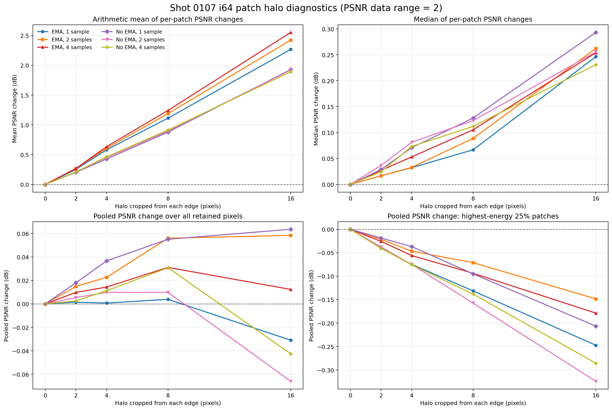
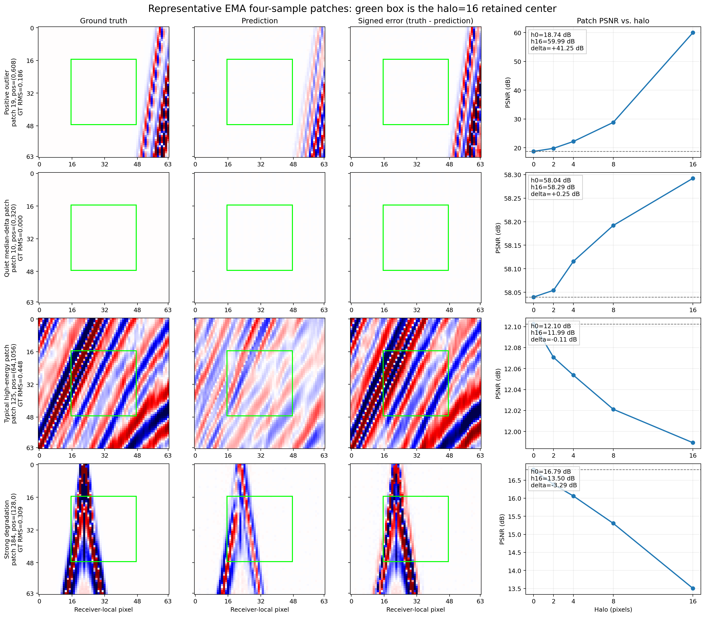

# 研究方向：Halo 中心裁剪

- 级别：暂停
- 最后更新：2026-08-28

## 研究目的

- 验证预测 patch 边缘是否比中心更不准确，以及只保留中心输出的 halo 推理是否值得优先实现。
- 区分逐 patch PSNR 算术平均的表面改善与总体像素误差、困难强信号区域的真实改善。

## 当前结论

- 当前判断：现有证据不足以支持继续扩大 halo，暂不投入 i64 中心裁剪后的完整铺炮实现。
- 主要证据：在 DiT-T/4、i64、NeRF bands0、epoch 100、`shot_0107` 上，halo=16 的逐 patch PSNR 算术平均提高 `1.891～2.552 dB`，但中位增益只有 `0.231～0.293 dB`，全部像素 pooled PSNR 变化仅 `-0.066～+0.064 dB`；真值能量最高25%的104个困难 patch 在全部权重、采样数和 halo 组合下均退化。
- 解释：少数 patch 的强事件位于被裁掉的边缘，而保留中心接近空白，产生数十 dB 的正向离群值并拉高逐 patch PSNR 算术平均；该现象不能解释为普遍的边缘质量改善。
- 局限或尚未确认的问题：当前证据只覆盖 bands0、epoch 100 和单炮，且比较的是同一64×64 patch 内不同裁剪区域，不等价于输入更大上下文后的完整 halo 铺炮结果。该结论只暂停 halo 子方向，不能外推为增大 patch size 无效。

## 暂停决策

- 暂停原因：halo 对总体 pooled PSNR 没有稳定收益，在最重要的高能量困难 patch 上反而一致退化；继续实现完整 i64 halo 铺炮的预期收益不足。
- 重新考虑条件：最佳 bands3 + EMA 的完整验证集显示困难 patch 中心区域稳定优于边缘，或者 i128 输入预测中心64在固定困难炮上稳定改善，并出现明确的边缘质量差异。
- 与主线关系：增大 patch size 仍在 [Patch Size 与有效上下文](directions_patch_size.md) 中继续研究；只有主线产生新的正面边缘证据时才恢复 halo。

## 实验记录

### 2026-08-28：i64 patch halo PSNR 诊断

- 相关月志：[2026-08-28](202608.md#2026-08-28)。
- 目的：直接检查 i64 预测 patch 的中心区域是否比边缘区域更准确。
- 方法与配置：对 `shot_0107` 的414个64×64 patch，同时从真值和预测四周裁掉 `0、2、4、8、16` 像素；比较 EMA/No-EMA 以及1、2、4次独立采样平均，共6组输出。
- PSNR 口径：数据定义范围为 `[-1,1]`，所以 `data_range=2`，使用 `PSNR = 10 log10(data_range²/MSE) = 10 log10(4/MSE)`。
- 对照：halo=0 为同一预测 patch 的未裁剪基线。除逐 patch PSNR 的算术平均和中位数外，先汇总保留像素 MSE 后计算 pooled PSNR，并固定统计真值 RMS 能量最高25%的104个 patch。
- 输入：`temp/shot_dataset64/valid/patches_0107.npy`，shape 为 `[414,64,64]`。
- 输出：`temp/new2/recon_DiTSeisDimReconNeRF_t_p4_i64_NeRFBands0/valid_{ema,no_ema}_samples_{1,2,4}_shot_0107_epoch_00100/patches_0107.npy`，每组 shape 为 `[414,1,64,64]`。

#### Halo=16 汇总

| 权重 | 采样数 | Patch mean Δ | Patch median Δ | 改善数 | 全部像素 pooled Δ | 高能量25% pooled Δ |
|---|---:|---:|---:|---:|---:|---:|
| EMA | 1 | +2.268 dB | +0.246 dB | 257/414 | -0.031 dB | -0.247 dB |
| EMA | 2 | +2.424 dB | +0.262 dB | 255/414 | +0.058 dB | -0.148 dB |
| EMA | 4 | +2.552 dB | +0.254 dB | 256/414 | +0.012 dB | -0.179 dB |
| No EMA | 1 | +1.930 dB | +0.293 dB | 266/414 | +0.064 dB | -0.207 dB |
| No EMA | 2 | +1.920 dB | +0.256 dB | 255/414 | -0.066 dB | -0.324 dB |
| No EMA | 4 | +1.891 dB | +0.231 dB | 256/414 | -0.043 dB | -0.286 dB |

其中：

- `Patch mean/median Δ` 是414个逐 patch `PSNR_halo16 - PSNR_halo0` 的平均值/中位数。
- `改善数` 是逐 patch PSNR 上升的数量，只表示覆盖率，不表示改善幅度。
- `pooled Δ` 是先汇总保留像素的平方误差再计算 PSNR，最后减去 halo=0；它不是 Gaussian blending 后的整炮 PSNR。
- `高能量25% pooled Δ` 使用按真值 RMS 固定选择的104个强信号 patch，对所有配置保持同一集合。

下图显示逐 patch算术平均随 halo 增大，但 pooled PSNR 基本不变，高能量困难 patch 持续下降。

#### 代表性 patch

| 类型 | Patch | 位置 | 真值 RMS | Halo 0 PSNR | Halo 16 PSNR | 变化 | 说明 |
|---|---:|---|---:|---:|---:|---:|---|
| 正向离群值 | 19 | `(0,608)` | 0.186 | 18.743 | 59.991 | +41.248 dB | 强事件几乎全部位于被裁掉的右侧，保留中心接近空白。 |
| 安静的中位变化 patch | 10 | `(0,320)` | 0.000 | 58.040 | 58.292 | +0.252 dB | 整块几乎为空，接近全部 patch 的中位增益。 |
| 典型高能量 patch | 125 | `(64,1056)` | 0.448 | 12.103 | 11.989 | -0.113 dB | 中心包含密集斜同相轴，裁剪没有改善预测。 |
| 明显退化 patch | 184 | `(128,0)` | 0.309 | 16.792 | 13.503 | -3.289 dB | 强事件穿过中心，halo 越大 PSNR 越低。 |

#### 版本与实现

- Git：`5bd2d84`（dirty）。
- 未提交相关文件：`AverageNpy.py`、`research_logs/202608.md`、`research_logs/directions_halo.md`、`research_logs/directions_patch_size.md`、`research_logs/directions_board.md`、`research_logs/images/20260828/patch_halo_psnr_summary.png`、`research_logs/images/20260828/patch_halo_representative_patches.png`。
- 入口脚本：`scripts/mac/recon_DiTSeisDimReconNeRF_t_p4_i64_NeRFBands0.sh`。
- 主要代码：`DiTSeisDimReconNeRF.py`、`AverageNpy.py`。
- Checkpoint：`temp/new2/train_DiTSeisDimReconNeRF_t_p4_i64_NeRFBands0/20260811_163640_970599/checkpoint_epoch_00100`。
- 关键配置：DiT-T/4、input size 64、NeRF bands0、EMA/No-EMA、solver step size 0.05、clip `[-1,1]`、seed 0～3、PSNR data range 2。
- 结果目录：`temp/new2/recon_DiTSeisDimReconNeRF_t_p4_i64_NeRFBands0`。

## 下一步

1. 暂不继续实现或扩展 i64 halo 铺炮，保留现有数据、图和结论。
2. 先完成 Patch Size 主线的 i64/i128 中心64直接对照。
3. 仅在满足重新考虑条件时，使用同一 i128 checkpoint 比较完整输出与中心裁剪输出，并在完整验证集上评价结构误差和计算成本。
