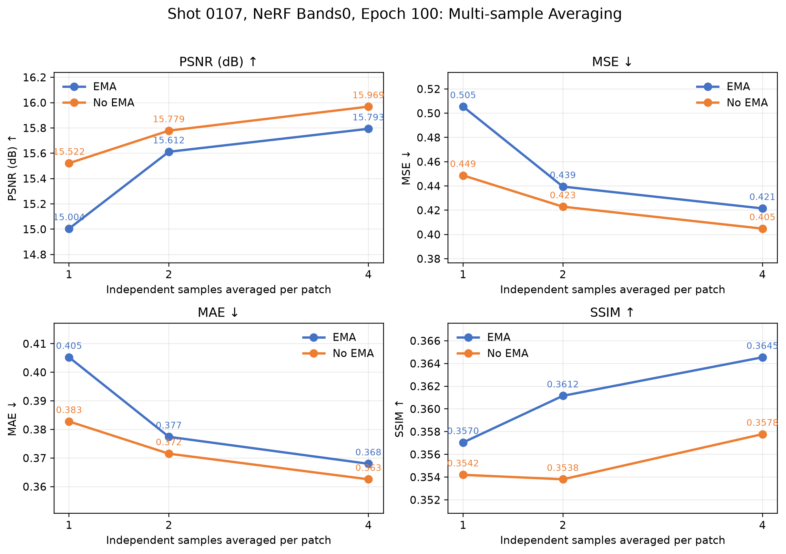

# 研究方向：多次独立采样平均

- 级别：重要
- 最后更新：2028-08-27

## 研究目的

- 验证同一个 patch 使用多个独立噪声采样并对输出求平均，能否在不重新训练模型的情况下稳定提高整炮重建精度。
- 判断多次采样主要降低随机误差，还是也能修复事件位置、相位和连续性等结构性误差。

## 当前结论

- 当前判断：多次独立采样平均是有效的推理端优化，能够降低随机方差、MSE、MAE 和极端误差；但收益递减、计算成本近似线性增长，也不能消除 patch 上下文不足造成的结构性误差。
- 主要证据：在 bands0、epoch 100、`shot_0107` 上，4 次平均相对单次采样使 EMA 的 PSNR 提高 0.789 dB、MSE 降低 16.6%，使无 EMA 的 PSNR 提高 0.447 dB、MSE 降低 9.8%。
- 局限或尚未确认的问题：目前只有单炮、单 checkpoint 和 bands0 结果；尚未确认当前最佳 bands3 + EMA、困难炮及完整 75 炮上的稳定收益，也未完成精度与推理时间的性价比评估。

## 实验记录

### 2028-08-27：shot_0107 的 1、2、4 次独立采样平均

- 相关记录：[2028-08-27 研究日志](20280827.md#6-多次独立采样平均实验)
- 目的：验证增加独立采样次数能否稳定改善指标，并判断其能否修复结构性误差。
- 方法与配置：模型为 DiT-NeRF t-p4 i64、NeRF bands0、epoch 100；测试 `shot_0107`；分别使用 EMA 和无 EMA；独立 seed 为 0、1、2、3；先完成 4 次 patch 推理，再复用前 1、2、4 份输出求平均；平均后的 patch 使用相同 Gaussian blending 重建整炮；推理使用 `--clip_recon -1 1`。
- 对照：相同模型和权重下的单次独立采样。
- 结果：

| 权重 | 采样次数 | PSNR | MSE | MAE | SSIM | 最大绝对误差 |
|---|---:|---:|---:|---:|---:|---:|
| EMA | 1 | 15.004 | 0.505 | 0.405 | 0.3570 | 4.000 |
| EMA | 2 | 15.612 | 0.439 | 0.377 | 0.3612 | 3.825 |
| EMA | 4 | 15.793 | 0.421 | 0.368 | 0.3645 | 3.464 |
| 无 EMA | 1 | 15.522 | 0.449 | 0.383 | 0.3542 | 4.000 |
| 无 EMA | 2 | 15.779 | 0.423 | 0.372 | 0.3538 | 3.860 |
| 无 EMA | 4 | 15.969 | 0.405 | 0.363 | 0.3578 | 3.559 |

- 观察：1 次增加到 2 次时收益最大，继续增加到 4 次仍有提升但明显递减。误差振幅和最大绝对误差降低，但主要红蓝条纹仍沿原有同相轴分布。
- 解释：独立噪声产生相关性较低的预测，求平均能够降低随机方差；相同位置持续存在的事件相位和连续性误差属于系统误差，不能通过简单平均消除。

#### 结果图片

下图展示 1、2、4 次独立采样下的 PSNR、MSE、MAE 和 SSIM。随着采样次数增加，PSNR 总体提高，MSE 和 MAE 持续下降，但收益逐渐减小。

下图比较不同采样次数的误差分布。多次平均降低了误差幅度和极端误差，但沿同相轴分布的红蓝条纹仍然存在。

#### 版本与实现

- Git：实验运行时 commit 未记录；本次整理时为 `0d81338`（dirty）。
- 未提交相关文件：`AverageNpy.py`、`research_logs/images/20280827/shot0107_multisample_metric_curves.png`、`research_logs/images/20280827/shot0107_multisample_error_maps.png`。
- 入口脚本：`scripts/mac/recon_DiTSeisDimReconNeRF_t_p4_i64_NeRFBands0.sh`。
- 主要代码：`DiTSeisDimReconNeRF.py`、`AverageNpy.py`、`ReconShotDataset2.py`、`DiffShot.py`、`core/patching/patch_ops.py`。
- 关键配置：DiT-NeRF t-p4 i64、bands0、epoch 100、`shot_0107`、EMA/无 EMA、seed 0～3、采样次数 1/2/4、solver step size 0.05、clip `[-1, 1]`。
- 结果目录：当前 macOS 脚本默认写入 `new2/recon_DiTSeisDimReconNeRF_t_p4_i64_NeRFBands0/`；原日志未记录实验运行时的精确绝对路径。

## 下一步

1. 在当前最佳 bands3 + EMA checkpoint 上比较 1、2、4 次独立采样。
2. 先测试最差 16 炮和若干简单炮，确认不同难度样本的收益是否一致。
3. 如果大部分炮稳定提高，再扩展到完整 75 炮验证集。
4. 同时记录精度、推理时间和资源消耗，评估 2 次与 4 次采样的性价比。
5. 将多次采样定位为推理端降方差优化；结构性误差仍通过扩大有效上下文、halo 输入和困难炮重采样解决。
