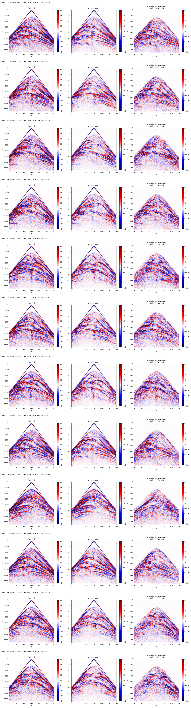
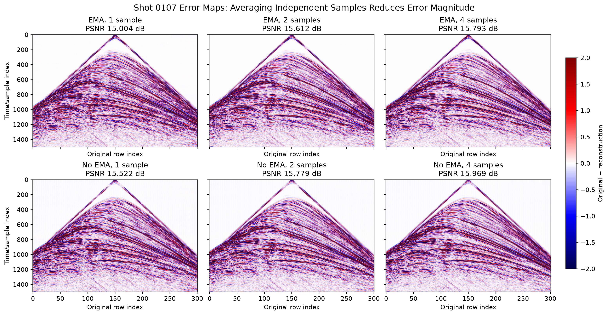

# 研究方向：Patch Size 与有效上下文

- 级别：下一步重点
- 最后更新：2026-08-28

## 研究目的

- 验证当前 64×64 输入 patch 的有效上下文不足，是否是困难炮中事件相位、位置和连续性错误的主要原因。
- 在模型架构、坐标编码、数据划分和优化设置一致的条件下，直接比较 i64 与 i128，判断更大的联合生成区域是否改善复杂、弯曲、密集和交叉同相轴。
- 在精度收益、训练显存、GPU-hours 和推理时间之间确定是否值得继续使用 i128；若没有稳定收益，不进入 i256。

## 当前结论

- 当前判断：增大 patch size 仍是一个尚未完成因果验证的假设，而不是已有明确收益的方案。困难炮的结构性误差与有限上下文假设一致，但当前没有 NeRF-DiT bands3 + EMA 的 i64/i128 严格对照，因此证据不足以判断 i128 有效或无效。
- 主要证据：低 PSNR 炮的误差集中在中下部密集波场，并沿长距离、弯曲和交叉同相轴形成相位、位置和连续性错误；多次独立采样可以降低随机误差幅度，却没有改变主要结构性误差的位置。这说明问题不只是采样噪声，但不能单独证明 patch size 是原因。
- 局限或尚未确认的问题：已有 PixelDiT i128/i256 结果同时改变了模型体系、训练设置和数据构成，不能用于 NeRF-DiT 的 patch size 归因。增大输入从64到128会使 DiT-T/4 token 数从256增至1024，同时改变单样本计算量和可用 batch。为匹配样本数而提高 overlap 只增加高度相关的平移裁剪，不增加独立地震信息，并显著增加磁盘、I/O 和训练成本。
- 相关暂停方向：[Halo 中心裁剪](directions_halo.md)。

### 当前证据图片

下图显示最差炮的误差主要沿复杂同相轴、强反射和弯曲结构分布，支持进一步检验输入上下文，但不构成 patch size 的因果证据。

下图显示多次独立采样降低了随机误差幅度，但主要同相轴红蓝条纹仍然保留。

## 数据现状

- i64 数据：`temp/shot_dataset64`，训练/验证炮为176/75，每炮414个64×64 patch，overlap=32、stride=32。
- 现有 i128 数据：`temp/shot_dataset128`，训练/验证炮同为176/75，每炮48个128×128 patch；当前实际 overlap=32、stride=96，需要按新的样本数匹配参数重建。
- 样本数匹配参数：i64 使用 overlap=32、stride=32，每炮414块；i128 使用 overlap=101、stride=27，每炮416块；i256 使用 overlap=242、stride=14，每炮450块。i256 在当前标量 overlap 同时作用于两轴的实现下无法更接近414，下一档为336块。
- 数据成本：只计算 seismic 与5通道坐标的 float32 patch 数据，每炮约为 i64 `0.038 GiB`、i128 `0.152 GiB`、i256 `0.659 GiB`；还未计入随机数据副本和其他输出。
- 三种现有尺寸的数据文件名和炮级训练/验证划分已经核对一致；正式实验仍需记录数据构建命令和元数据校验结果。

## 测试设计

### 阶段 1：i128 数据与实现核对

- 使用 i128/overlap101 重建数据，确保与 i64 使用相同的176/75炮级划分、归一化、裁剪范围和坐标统计，并核对每炮416块。
- 从现有 i64 bands3 + EMA 配置派生 i128 训练和推理入口，不改变 DiT-T/4、NeRF bands、EMA、优化器或学习率策略。
- 完成模型构建、单 batch 前向/反向、checkpoint 保存与恢复、单炮标准拼接重建的 smoke test。
- 记录最大显存、单步耗时、可用 micro-batch 和梯度累积步数。

### 阶段 2：受控短程训练

| 组别 | 输入 patch | 训练 overlap | 模型 | NeRF | 权重 | 说明 |
|---|---:|---:|---|---:|---|---|
| A 基线 | 64×64 | 32 | DiT-T/4 | bands3 | EMA | 当前最佳体系 |
| B 大输入 | 128×128 | 101 | DiT-T/4 | bands3 | EMA | 每炮416块，匹配 i64 样本数 |

- 使用相同炮级划分、随机种子、数据预处理、优化器和学习率策略。
- 以相同 optimizer step 比较学习曲线，不只按 epoch 比较；同时报告处理像素数、token 数、wall-clock 和 GPU-hours。
- 初始 batch 对齐目标按每步处理像素量设置：若 i64 有效 batch 为32，则 i128 目标有效 batch 为8；实际 micro-batch 与 gradient accumulation 由显存 smoke test 决定。
- 高 overlap 数据只提供更密集的平移裁剪，不能视为416个独立样本；训练结论必须结合炮级验证和结构指标，不只比较训练 loss。
- 固定按 optimizer step 保存 checkpoint，先做短程趋势筛选，不默认进入完整长训练。

### 阶段 3：共同目标区域评测

- 在相同空间位置定义64×64目标区域：i64 使用对应64×64输入，i128 使用包含该目标区域的128×128输入，只在同一64×64目标像素上计算核心指标。
- 固定验证炮、目标区域和推理采样数，避免因每像素独立预测次数不同而把采样集成收益归因于 patch size。
- 主要报告完整75炮、固定最差16炮以及真值高能量 patch 的 paired 指标变化。
- 结构指标包括同相轴红蓝条纹、事件连续性、局部最佳时间偏移、强振幅符号错误和 SSIM；同时报告 MSE、MAE 与 PSNR。

### 阶段 4：整炮应用与决策

- 只有阶段3显示 i128 在固定困难样本上稳定改善时，才继续完整训练；整炮比较使用各自预先固定的滑窗网格和标准 Gaussian blending，并同时报告输出 patch 数量。
- 成本指标包括训练显存、单步时间、总 GPU-hours、单炮推理时间和输出 patch 数量。
- i128 需要在多数固定困难炮和高能量 patch 上稳定改善，且完整验证集不出现系统性退化，才继续完整训练。
- 若短程 i128 没有清晰收益，则暂停扩大 patch，不继续 i256。

## 计划版本与实现

- Git：`5bd2d84`（dirty）；i64/i128 受控对照尚未运行。
- 未提交相关文件：`scripts/hwgpu/build_shot_dataset.sh`、`scripts/mac/build_shot_dataset.sh`、`research_logs/202608.md`、`research_logs/directions_patch_size.md`、`research_logs/directions_board.md`。
- 现有入口脚本：`scripts/hwgpu/train_DiTSeisDimReconNeRF_t_p4_i64_NeRFBands3.sh`、`scripts/hwgpu/recon_DiTSeisDimReconNeRF_t_p4_i64_NeRFBands3.sh`、`scripts/hwgpu/build_shot_dataset.sh`。
- 数据构建入口已更新：`scripts/hwgpu/build_shot_dataset.sh` 和 `scripts/mac/build_shot_dataset.sh` 默认使用 i64/o32、i128/o101、i256/o242，并支持 `OVERLAP_SIZE_64/128/256` 环境变量覆盖。
- 计划新增入口：i128 bands3 + EMA 的训练和标准拼接推理脚本或参数。
- 主要代码：`DiTSeisDimReconNeRF.py`、`BuildShotDataset2.py`、`ReconShotDataset2.py`、`models/wrapper.py`、`core/patching/patch_ops.py`。
- 数据计划：保留 `shot_dataset64` 基线；使用 i128/overlap101 重建样本数匹配数据，并验证炮级划分和每炮 patch 数。i256 数据虽然参数已配置，但不在 i128 出现稳定收益前启动训练。
- 结果目录：按 i64/i128 组别建立独立目录，记录绝对路径、checkpoint、评测输出和成本日志。

## 下一步

1. 明确 i64/i128 的共同64×64目标区域、训练预算、随机采样控制和停止条件。
2. 使用 i128/overlap101 重建并核对每炮416块，完成单 batch、checkpoint 恢复和单炮标准拼接 smoke test。
3. 短程对比 i64/overlap32 与 i128/overlap101，重点评价固定最差16炮、高能量 patch 和结构误差，并报告高重叠的存储与计算成本。
4. 仅在 i128 对共同目标区域产生稳定收益后继续完整训练和整炮比较；否则暂停扩大 patch，不进入 i256。
