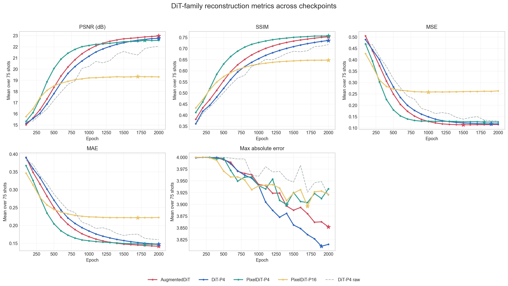
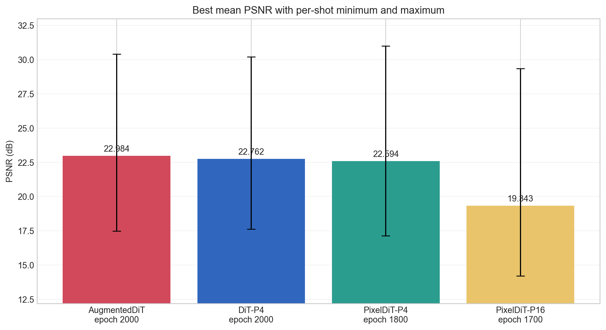
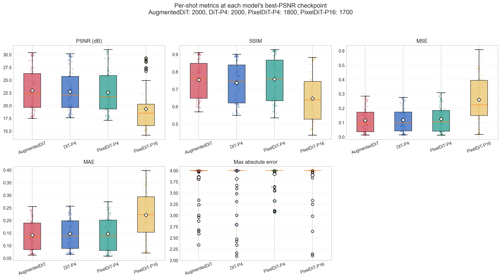
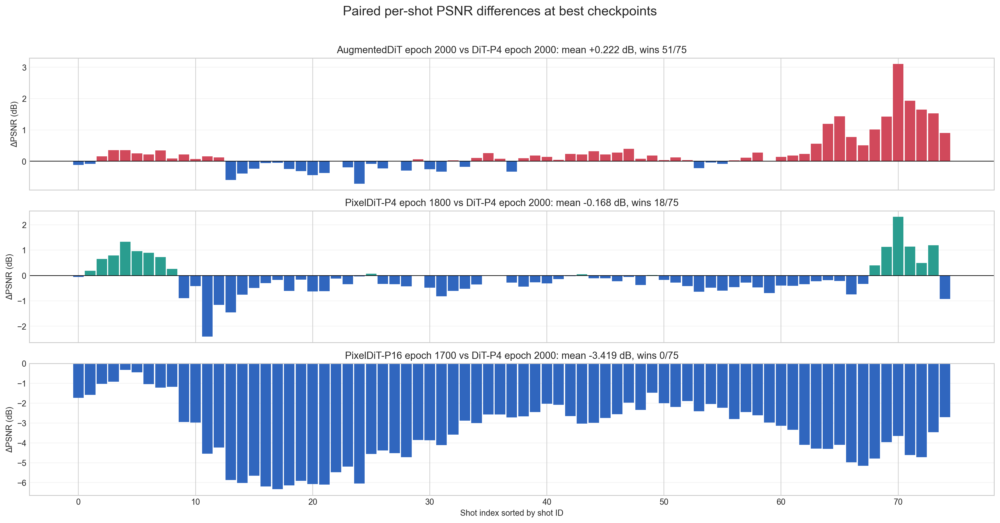

# 研究方向：PixelDiT 双路径与 Patch Size 对照

- 级别：保留
- 最后更新：2026-09-02

## 研究目的

- 验证 PixelDiT 的 augmented patch pathway 与 pixel-level pathway 能否比传统 DiT 更快、更准确地恢复地震局部结构。
- 比较64×64输入下 patch size 4和16的收敛、最终精度与逐炮稳定性，判断pixel-level分支能否补偿粗粒度patch表示。
- 区分结构相似性改善与PSNR、MSE等像素精度改善，避免只凭单项指标判断高频恢复效果。

## 当前结论

- 当前判断：PixelDiT-P4前中期收敛快且SSIM最高，但最终PSNR和MSE没有超过传统DiT；PixelDiT-P16明显退化。该方向仍有定向研究价值，但暂不作为优先主线。
- 主要证据：PixelDiT-P4在epoch 900达到22.018 dB，但最佳平均PSNR为22.594 dB，比DiT低0.168 dB，仅在18/75炮上胜出；其最佳checkpoint SSIM比DiT高0.0201并在64/75炮上胜出。PixelDiT-P16最佳PSNR只有19.343 dB，比DiT低3.419 dB，75炮全部落后。
- 局限或尚未确认的问题：当前只有一个随机种子，PixelDiT-P4和P16训练脚本使用的节点数不同，不是严格等全局batch或等优化步数实验；尚未计算频带误差、局部相位、包络和高能量区域指标，因此SSIM提高不能直接解释为高频恢复已经改善。

## 保留决定

- 保留原因：P4的早期收敛和SSIM优势尚未转化为更高PSNR或更低MSE，P16则出现约3.4 dB的明显退化；但P4的结构相似性表现说明双路径架构仍值得用于定向实验。
- 重新考虑条件：复杂patch加权采样、分层时间采样、频域或小波辅助损失等定向实验，使PixelDiT-P4在多随机种子下稳定超过DiT或AugmentedDiT，并在困难炮及高频指标上给出一致收益。

## 实验记录

### 2026-09-02：PixelDiT-P4/P16 与 DiT 系列统一重建对比

- 相关月志：暂无，本次仅建立方向记录。
- 目的：将新增PixelDiT-P4、PixelDiT-P16结果与AugmentedDiT、传统DiT的既有结果放在同一验证集和指标体系下比较。
- 方法与配置：四个主模型均使用i64、NeRF bands0和EMA，统计epoch 100–2000的20个checkpoint及同一75炮；DiT非EMA仅用于核对EMA收益，不参与架构排名。
- 对照：传统DiT-P4 EMA为主要基线，AugmentedDiT EMA作为已知轻微改进模型。
- 结果：AugmentedDiT综合最好；PixelDiT-P4前期收敛最快、SSIM最好，但最佳PSNR略低于DiT；PixelDiT-P16在PSNR、SSIM、MSE和MAE上均明显落后。
- 观察：PixelDiT-P4在epoch 500达到20.065 dB、epoch 900达到22.018 dB，明显快于AugmentedDiT和DiT，但此后基本平台化；P16在约epoch 1000后停留在19.3 dB附近。
- 解释：PixelDiT-P4整体架构有利于快速学习结构相似性，但当前损失、时间采样或双路径融合没有把这一优势转化为最终像素精度。P16在64×64输入上只有16个patch token，粗粒度patch表示可能是退化因素之一，但尚未通过严格消融证明。

#### Epoch 2000平均指标

| 模型 | PSNR（dB） | SSIM | MSE | MAE | 最大绝对误差 |
|---|---:|---:|---:|---:|---:|
| AugmentedDiT | **22.9842** | 0.75350 | **0.11536** | **0.14173** | 3.85205 |
| DiT-P4 | 22.7621 | 0.73651 | 0.11854 | 0.14751 | **3.81510** |
| PixelDiT-P4 | 22.5777 | **0.75733** | 0.12649 | 0.14706 | 3.93307 |
| PixelDiT-P16 | 19.3113 | 0.64787 | 0.26357 | 0.22240 | 3.92113 |

#### 各模型最佳PSNR checkpoint

| 模型 | Epoch | 平均PSNR | 最差炮 | 最差PSNR | 最好炮 | 最好PSNR | 相对DiT | PSNR胜出炮数 |
|---|---:|---:|---|---:|---|---:|---:|---:|
| AugmentedDiT | 2000 | **22.9842** | `shot_0127` | 17.4932 | `shot_0039` | 30.4151 | +0.2221 dB | 51/75 |
| DiT-P4 | 2000 | 22.7621 | `shot_0128` | 17.6250 | `shot_0039` | 30.1979 | 基准 | — |
| PixelDiT-P4 | 1800 | 22.5941 | `shot_0127` | 17.1436 | `shot_0017` | **31.0003** | -0.1680 dB | 18/75 |
| PixelDiT-P16 | 1700 | 19.3427 | `shot_0118` | 14.1962 | `shot_0017` | 29.3502 | -3.4194 dB | 0/75 |

#### PixelDiT相对DiT的逐炮结果

| 模型 | 指标 | 模型均值 | 相对DiT变化 | 胜/平/负 |
|---|---|---:|---:|---:|
| PixelDiT-P4（epoch 1800） | PSNR | 22.5941 | -0.1680 dB | 18/0/57 |
| PixelDiT-P4（epoch 1800） | SSIM | 0.75664 | +0.02013 | 64/0/11 |
| PixelDiT-P4（epoch 1800） | MSE | 0.12584 | 增加0.00730 | 18/0/57 |
| PixelDiT-P4（epoch 1800） | MAE | 0.14697 | 降低0.00054 | 42/0/33 |
| PixelDiT-P16（epoch 1700） | PSNR | 19.3427 | -3.4194 dB | 0/0/75 |
| PixelDiT-P16（epoch 1700） | SSIM | 0.64719 | -0.08932 | 0/0/75 |
| PixelDiT-P16（epoch 1700） | MSE | 0.26084 | 增加0.14230 | 0/0/75 |
| PixelDiT-P16（epoch 1700） | MAE | 0.22176 | 增加0.07425 | 1/0/74 |

#### PSNR收敛过程

| Epoch | AugmentedDiT | DiT-P4 | PixelDiT-P4 | PixelDiT-P16 |
|---:|---:|---:|---:|---:|
| 100 | 15.0166 | 15.1557 | 15.3317 | 15.7600 |
| 500 | 18.3729 | 17.8209 | **20.0652** | 18.5092 |
| 900 | 21.3856 | 20.7388 | **22.0179** | 19.1363 |
| 1000 | 21.7764 | 21.1612 | **22.1266** | 19.2210 |
| 1500 | **22.7247** | 22.3706 | 22.4637 | 19.3092 |
| 1800 | **22.8930** | 22.6692 | 22.5941 | 19.3235 |
| 2000 | **22.9842** | 22.7621 | 22.5777 | 19.3113 |

#### 版本与实现

- Git：`8860607`（dirty）。
- 未提交相关文件：`scripts/analysis/plot_dit_family_comparison.py`、`research_logs/directions_pixeldit.md`、`research_logs/directions_board.md`、`research_logs/images/20260902/*.png`。
- 入口脚本：`scripts/dreamcloud/train_PixelDiTSeisDimReconNeRF_t_p4_i64_NeRFBands0.sh`、`scripts/dreamcloud/recon_PixelDiTSeisDimReconNeRF_t_p4_i64_NeRFBands0.sh`、`scripts/dreamcloud/train_PixelDiTSeisDimReconNeRF_t_p16_i64_NeRFBands0.sh`、`scripts/dreamcloud/recon_PixelDiTSeisDimReconNeRF_t_p16_i64_NeRFBands0.sh`。
- 主要代码：`models/pixeldit.py`、`models/wrapper.py`、`PixelDiTSeisDimReconNeRF.py`、`scripts/analysis/plot_dit_family_comparison.py`。
- 关键配置：PixelDiT-T、i64、patch size 4或16、NeRF bands0、EMA、epoch 100–2000、75炮验证集。
- 结果目录：`temp/new/recon_PixelDiTSeisDimReconNeRF_t_p4_i64_NeRFBands0/`、`temp/new/recon_PixelDiTSeisDimReconNeRF_t_p16_i64_NeRFBands0/`、`temp/new/DiT_family_i64_NeRFBands0_statistics/`。

## 下一步

1. 暂不继续PixelDiT-P16的i64常规训练，也不把PixelDiT-P4作为当前默认主干。
2. 保留PixelDiT-P4用于复杂patch加权采样、分层时间采样和小波/频域辅助损失的小规模定向实验。
3. 只有在固定困难炮、高频指标和至少多个随机种子上稳定超过DiT或AugmentedDiT时，才将该方向提升为优先研究并恢复大规模训练。
