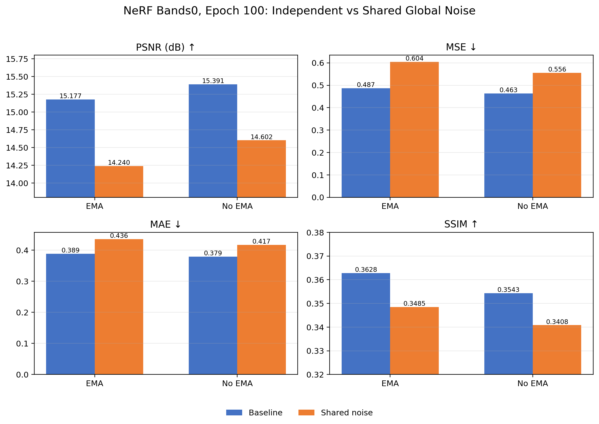
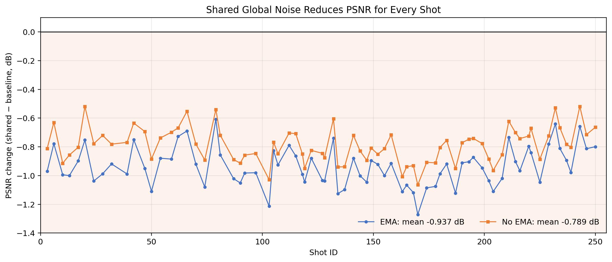
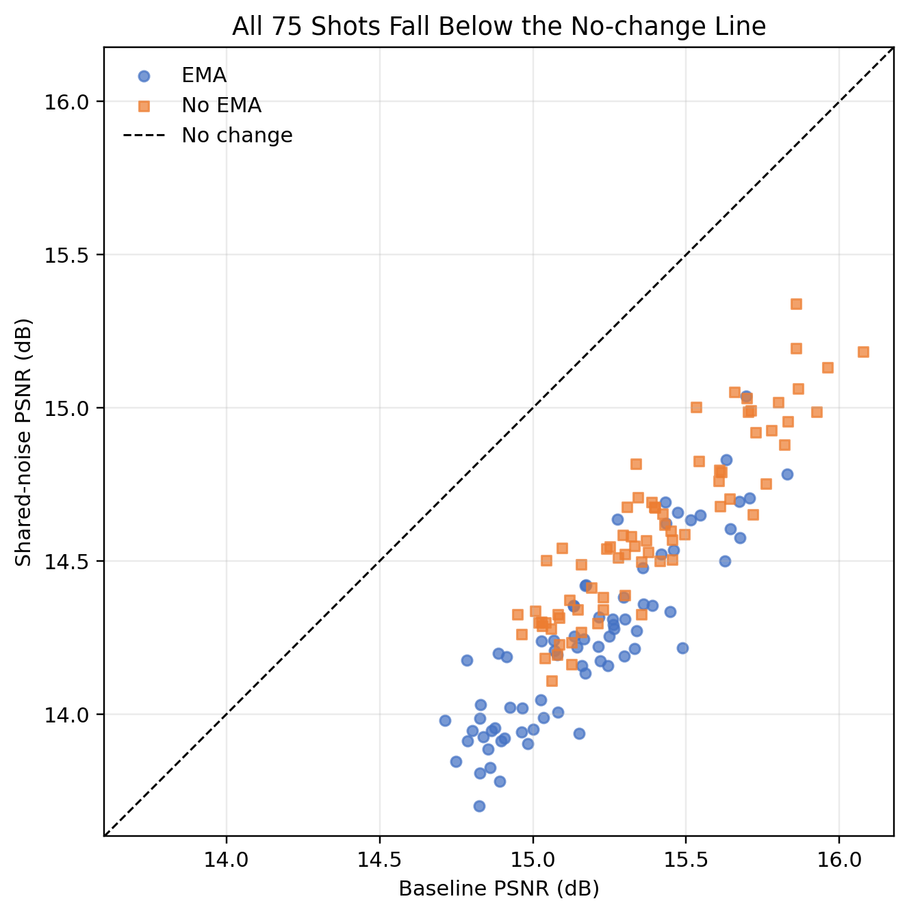
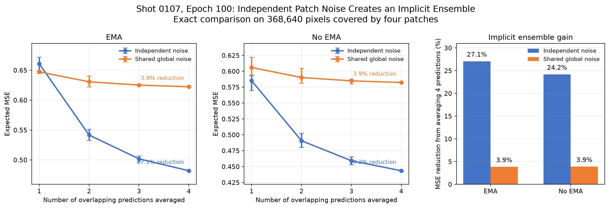

# 研究方向：全局共享噪声

- 级别：暂停
- 最后更新：2028-08-27

## 研究目的

- 验证相邻 patch 使用同一份全局噪声的重叠区域作为初值，能否降低重叠预测不一致，并改善整炮重建效果。

## 当前结论

- 当前判断：全局共享噪声确实显著提高了重叠 patch 的一致性，但单个全局噪声 seed 会使预测误差高度相关，失去独立 patch 噪声在 Gaussian blending 中的隐式集成收益。当前方法不适合作为默认推理方式。
- 主要证据：NeRF bands0、epoch 100 的 75 炮对比中，EMA 和无 EMA 的共享噪声结果全部变差，平均 PSNR 分别下降 0.937 dB 和 0.789 dB；`shot_0107` 的 4 patch 平均 MSE 降幅从独立噪声下的 24.2%～27.1%降至共享噪声下的 3.9%。
- 局限或尚未确认的问题：当前正式结果只使用 bands0、epoch 100 和一个固定全局 seed；尚未验证 bands3 + EMA，也未验证多个完整全局噪声重建结果再集成是否能兼顾一致性和多样性。

## 实验记录

### 2028-08-27：75 炮全局共享噪声对照

- 相关记录：[2028-08-27 研究日志](20280827.md#5-统一噪声第一组测试结果new2)
- 目的：比较 patch 独立噪声与全局共享噪声对完整验证集重建指标的影响。
- 方法与配置：先生成一份完整标准高斯随机炮，再按真实数据相同的位置切分 noise patch；模型为 DiT-NeRF t-p4 i64、NeRF bands0、epoch 100；分别测试 EMA 和无 EMA；推理使用 `--clip_recon -1 1`；每组使用相同的 75 炮。
- 对照：patch 独立噪声。
- 结果：

| 权重 | 噪声方式 | PSNR | MSE | MAE | SSIM |
|---|---|---:|---:|---:|---:|
| EMA | patch 独立噪声 | 15.177 | 0.487 | 0.389 | 0.3628 |
| EMA | 全局共享噪声 | 14.240 | 0.604 | 0.436 | 0.3485 |
| 无 EMA | patch 独立噪声 | 15.391 | 0.463 | 0.379 | 0.3543 |
| 无 EMA | 全局共享噪声 | 14.602 | 0.556 | 0.417 | 0.3408 |

- 观察：EMA 的平均 PSNR 下降 0.937 dB，MSE 增加 24.1%，MAE 增加 12.1%；无 EMA 的平均 PSNR 下降 0.789 dB，MSE 增加 19.9%，MAE 增加 9.9%。两种权重下 75 炮的逐炮 PSNR 差值全部小于 0。
- 解释：共享噪声使重叠预测误差更相关。虽然初始值更一致，但 Gaussian blending 无法像独立噪声那样抵消不同预测中的随机误差。

#### 结果图片

下图比较四组结果的平均 PSNR、MSE、MAE 和 SSIM。全局共享噪声在 EMA 和无 EMA 下都出现整体退化。

下图给出共享噪声相对独立噪声的逐炮 PSNR 变化。所有 75 炮的差值都小于 0。

下图将共享噪声结果与基线逐炮比较。散点全部位于等值线下方，说明退化不是少数困难炮造成的。

#### 版本与实现

- Git：实验运行时 commit 未记录；本次整理时为 `0d81338`（dirty）。
- 未提交相关文件：`research_logs/images/20280827/new2_metric_comparison.png`、`research_logs/images/20280827/new2_psnr_delta_by_shot.png`、`research_logs/images/20280827/new2_psnr_scatter.png`、`research_logs/images/20280827/shot0107_global_noise_edge_padding_evidence.png`、`research_logs/images/20280827/shot0107_implicit_ensemble_evidence.png`。
- 入口脚本：`scripts/mac/build_shot_dataset.sh`、`scripts/mac/recon_DiTSeisDimReconNeRF_t_p4_i64_NeRFBands0_ExternalNoise.sh`。
- 主要代码：`BuildRandomSegy.py`、`BuildShotDataset2.py`、`DiTSeisDimReconNeRFExternalNoise.py`、`ReconShotDataset2.py`、`core/patching/patch_ops.py`。
- 关键配置：DiT-NeRF t-p4 i64、NeRF bands0、epoch 100、EMA/无 EMA、75 炮、全局随机 seed 0、overlap 32、solver step size 0.05、clip `[-1, 1]`。
- 结果目录：原日志记录为 `temp/new2`；精确历史运行子目录未记录。当前 macOS 脚本默认写入 `new2/recon_DiTSeisDimReconNeRF_t_p4_i64_NeRFBands0_ExternalNoise/`。

### 2028-08-27：shot_0107 重叠区域隐式集成验证

- 相关记录：[2028-08-27 研究日志](20280827.md#shot_0107-的隐式集成验证)
- 目的：验证共享噪声是否成功提高 patch 一致性，以及整炮指标退化是否与隐式集成收益消失有关。
- 方法与配置：选择 `shot_0107` 中被 4 个 patch 同时覆盖的 368,640 个像素，枚举 1、2、3、4 个 patch 预测的所有组合并计算期望 MSE，同时统计融合前重叠输出标准差。
- 对照：相同模型和权重下的 patch 独立噪声。
- 结果：独立噪声下，4 个预测平均使 EMA 和无 EMA 的 MSE 分别下降 27.1% 和 24.2%；共享噪声下两者均只下降 3.9%。共享噪声使融合前输出标准差由 0.1267 降至 0.0417（EMA），由 0.1118 降至 0.0405（无 EMA）。
- 观察：共享噪声显著降低了不同 patch 输出间的差异，但参与融合的 patch 数增加时，MSE 几乎不再下降；共享噪声结果也保留了更多接近 `±1` 的极端值。
- 解释：共享噪声生效了，但更高的一致性同时代表误差相关性更高，因此失去了独立预测的平均降噪收益。

#### 结果图片

下图展示参与平均的 patch 数量与期望 MSE 的关系。独立噪声下 MSE 随预测数量增加而明显下降，共享噪声下曲线几乎不变。

#### 版本与实现

- Git：实验运行时 commit 未记录；本次整理时为 `0d81338`（dirty）。
- 未提交相关文件：同上一实验记录中的分析图片；未发现与共享噪声实现直接相关的未提交代码。
- 入口脚本：`scripts/mac/recon_DiTSeisDimReconNeRF_t_p4_i64_NeRFBands0_ExternalNoise.sh`。
- 主要代码：`DiTSeisDimReconNeRFExternalNoise.py`、`ReconShotDataset2.py`、`core/patching/patch_ops.py`。
- 关键配置：`shot_0107`、DiT-NeRF t-p4 i64、bands0、epoch 100、EMA/无 EMA、4 patch 重叠区域。
- 结果目录：原日志未记录精确分析输出目录；相关图片位于 `research_logs/images/20280827/`。

## 下一步

1. 暂停继续扩展单个全局共享噪声 seed 的实验，不将其设为默认推理方式。
2. 在多次独立采样完成 bands3 + EMA 和困难炮验证后，再决定是否测试多个完整全局噪声 seed 的整炮重建集成。
3. 重新启动时同时记录空间一致性、整炮指标、极端值比例和推理成本，判断能否兼顾一致性与集成收益。
